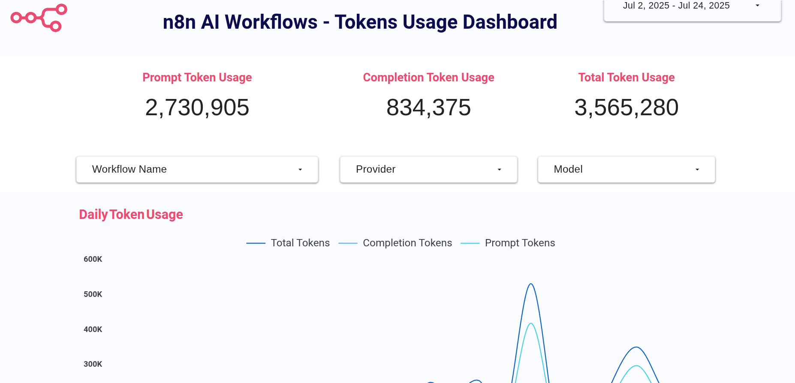
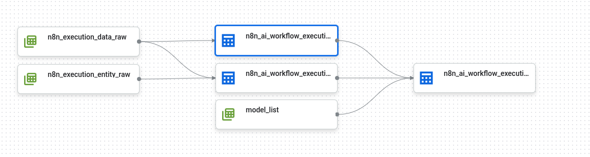

# n8n AI Workflow – Token Usage Dashboard – Dataform Transformations

This repository demonstrates how to build a reporting dashboard for **token usage by n8n AI workflows** using SQL transformations with Dataform and Google BigQuery.

## Prerequisites

This repository contains only the **Dataform files** that generate the reporting table, which is then connected to Looker Studio. You will need:

- Access to a Google Cloud Platform project  
- A Google BigQuery dataset containing a “raw” copy of your n8n Postgres tables `execution_entity` and `execution_data` (for testing, you can export a small CSV sample and import it into BigQuery)  
- A `model_list` table in your raw dataset listing the LLMs and providers used by your n8n workflows (you can use the example `model_list.csv` included here)  

## How It Works

The project uses three datasets:

1. **Raw** – holds the untransformed tables `execution_data`, `execution_entity`, plus the reference table `model_list`  
2. **Staging** – contains the transformed data via Dataform models  
3. **Reporting** – contains the final table connected to Looker Studio  

---
### DAG

### Raw Dataset

The raw dataset includes three tables:

#### `n8n_execution_data_raw`

| Column Name  | Type    | Description                                                                                     |
|--------------|---------|-------------------------------------------------------------------------------------------------|
| executionId  | INTEGER |                                                                                                 |
| workflowData | STRING  |                                                                                                 |
| data         | STRING  |                                                                                                 |
| created_at   | STRING  | *Optional*: copy record creation timestamp (not in the original table)                          |
| updated_at   | STRING  | *Optional*: copy record update timestamp (not in the original table)                            |

#### `n8n_execution_entity_raw`

| Column Name     | Type      | Description                                                                                     |
|-----------------|-----------|-------------------------------------------------------------------------------------------------|
| id              | INTEGER   |                                                                                                 |
| finished        | BOOLEAN   |                                                                                                 |
| mode            | STRING    |                                                                                                 |
| retryOf         | STRING    |                                                                                                 |
| retrySuccessId  | STRING    |                                                                                                 |
| startedAt       | TIMESTAMP |                                                                                                 |
| stoppedAt       | TIMESTAMP |                                                                                                 |
| waitTill        | STRING    |                                                                                                 |
| status          | STRING    |                                                                                                 |
| workflowId      | STRING    |                                                                                                 |
| deletedAt       | STRING    |                                                                                                 |
| createdAt       | TIMESTAMP |                                                                                                 |
| created_at      | STRING    | *Optional*: copy record creation timestamp (not in the original table)                          |
| updated_at      | STRING    | *Optional*: copy record update timestamp (not in the original table)                            |

#### `model_list`

| Column Name | Type   | Description |
|-------------|--------|-------------|
| model       | STRING |             |
| provider    | STRING |             |

---

### Staging Dataset

This dataset is populated by two Dataform models:

- `definitions/n8n_ai_workflow_execution_llm_model.sqlx`  
- `definitions/n8n_ai_workflow_execution_token_usage.sqlx`  

#### `n8n_ai_workflow_execution_llm_model`

Lists which LLM model was used in each workflow run:

| Column Name  | Type    | Description                                                                                                   |
|--------------|---------|---------------------------------------------------------------------------------------------------------------|
| id           | STRING  | Generated from `execution_id` + `item_id`, useful when using “loop over items”                                |
| executionId  | INTEGER |                                                                                                               |
| item_id      | INTEGER | Item index in a loop; set to 1 if no loop is used                                                            |
| model        | STRING  |                                                                                                               |

#### `n8n_ai_workflow_execution_token_usage`

Aggregates token usage per run (and per item when looping):

| Column Name       | Type      | Description                                                                                                    |
|-------------------|-----------|----------------------------------------------------------------------------------------------------------------|
| id                | STRING    | Generated from `execution_id` + `item_id`                                                                      |
| executionId       | INTEGER   |                                                                                                                |
| item_id           | INTEGER   | Item index in a loop; 1 if no loop is used                                                                     |
| workflow_id       | STRING    |                                                                                                                |
| workflow_name     | STRING    |                                                                                                                |
| active            | BOOLEAN   |                                                                                                                |
| created_at        | STRING    |                                                                                                                |
| updated_at        | STRING    |                                                                                                                |
| prompt_tokens     | INTEGER   | Tokens sent in the prompt                                                                                      |
| completion_tokens | INTEGER   | Tokens received in the completion                                                                               |
| total_tokens      | INTEGER   | Sum of prompt and completion tokens                                                                             |
| finished          | BOOLEAN   |                                                                                                                |
| started_at        | TIMESTAMP |                                                                                                                |
| finished_at       | TIMESTAMP |                                                                                                                |

---

### Reporting Dataset

Contains the final table used by Looker Studio:

#### `n8n_ai_workflow_execution_token_usage_report`

| Column Name       | Type      | Description                                                                                                    |
|-------------------|-----------|----------------------------------------------------------------------------------------------------------------|
| id                | STRING    | Generated from `execution_id` + `item_id`                                                                      |
| executionId       | INTEGER   |                                                                                                                |
| item_id           | INTEGER   | Item index in a loop; 1 if no loop is used                                                                     |
| started_at        | TIMESTAMP |                                                                                                                |
| finished_at       | TIMESTAMP |                                                                                                                |
| active            | BOOLEAN   |                                                                                                                |
| workflow_name     | STRING    |                                                                                                                |
| model             | STRING    |                                                                                                                |
| provider          | STRING    |                                                                                                                |
| prompt_tokens     | INTEGER   |                                                                                                                |
| completion_tokens | INTEGER   |                                                                                                                |
| total_tokens      | INTEGER   |                                                                                                                |
| finished          | BOOLEAN   |                                                                                                                |
# n8n-token-report
